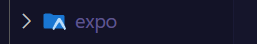
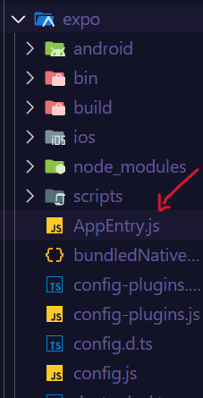
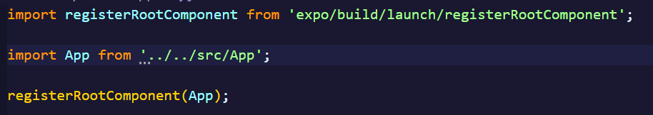
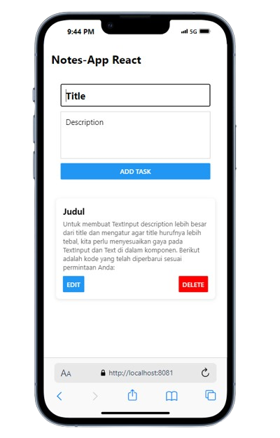

## Clone Project NotesAPP

`git clone https://github.com/DaffaMalik12/React-Native-NotesApp.git`

## Install Yarn di Laptopmu (Jika blm ada)

- `npm install -g yarn`

## Masuk Directory Backend

- `cd backend`

## Install Package Backend (Express js, mySQL)

- `npm install`
- `npm install express mysql2 body-parser cors`

## Nyalakan Server Backend

- `node server.js`
- Note: Jangan Lupa Nyalakan XAMPP nya

## Keluar Direktori backend

- `cd ../`

## Install Package Frontend (React Native)

- `npm install`
- `npm install axios`

## Jalankan Client Servernya (Frontend)

- Untuk dijalankan di web (jangan lupa pake extension mobile simulator di chrome) `npx expo start --web`
- Untuk Menjalankan di Android (Jika Punya Emulator di Android Studio) `npx expo start --android`

## Jika Tidak Muncul ketika dijalankan

- Buka Folder Node Modules di bawah folder database
  

- Cari File Expo
  

- Klik AppEntry.js
  

- Ubah Menjadi Seperti ini
  

## Contoh Gambar

